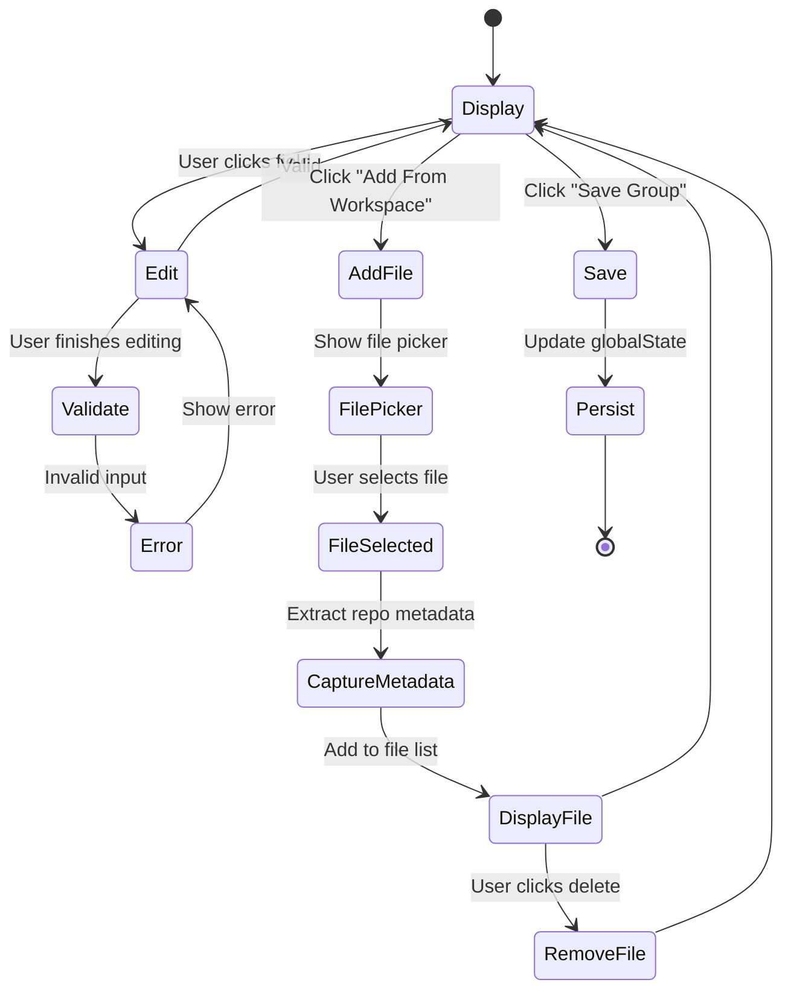
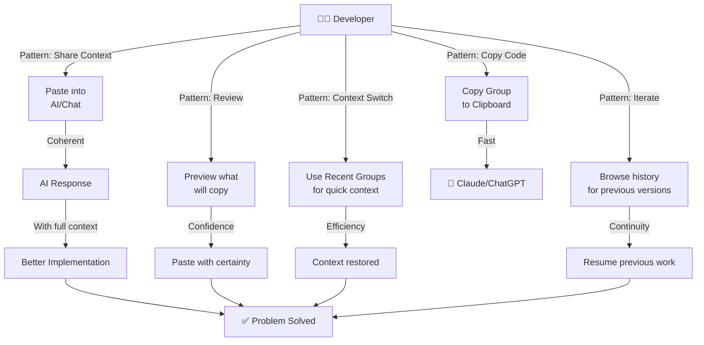
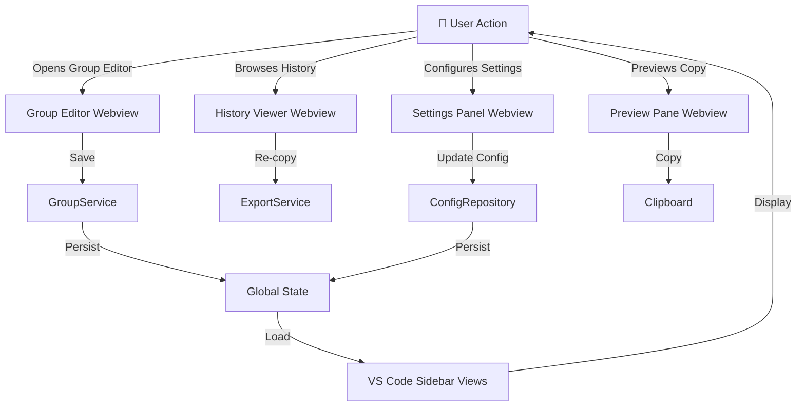
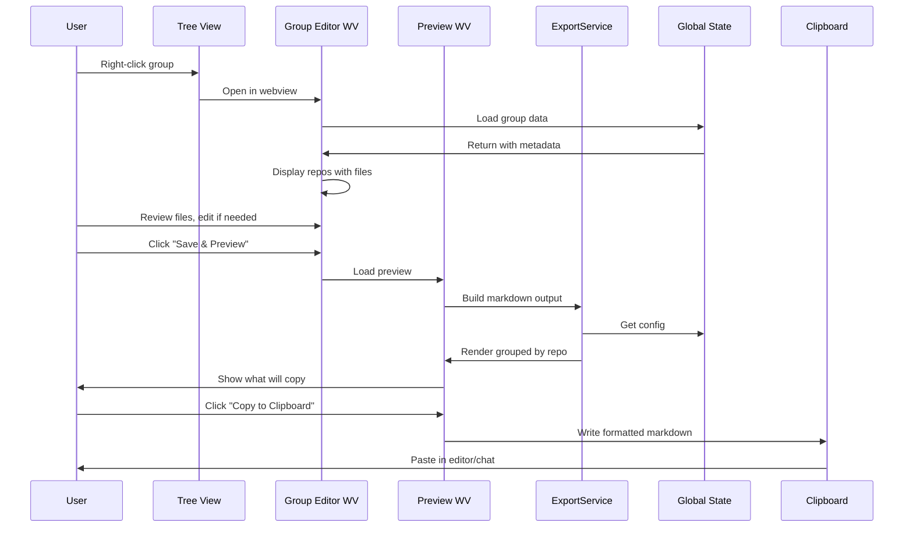
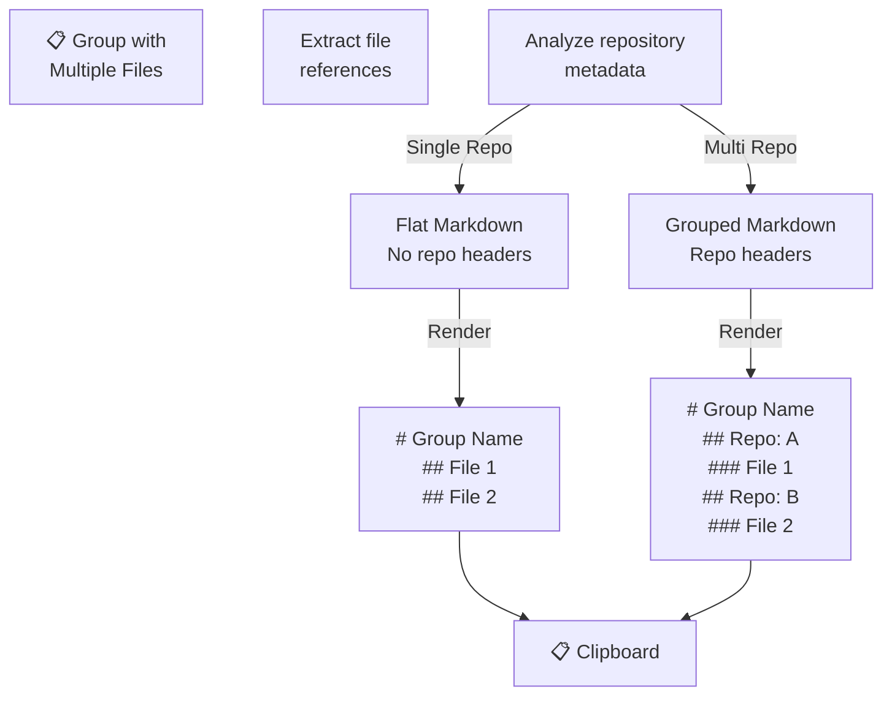

# Copy Groups Webview Design
## UI/UX Mockups & Architecture

---

## Table of Contents
1. [Webview Overview](#webview-overview)
2. [Group Editor Webview](#group-editor-webview)
3. [History Viewer Webview](#history-viewer-webview)
4. [Settings Panel Webview](#settings-panel-webview)
5. [Preview Pane Webview](#preview-pane-webview)
6. [User Journeys](#user-journeys)
7. [Architecture Flows](#architecture-flows)
8. [Data Flow Diagrams](#data-flow-diagrams)

---

## Webview Overview

```
┌─────────────────────────────────────────────────────────────┐
│  VS Code Extension: Copy Groups                             │
├─────────────────────────────────────────────────────────────┤
│                                                              │
│  ┌──────────────┐  ┌──────────────┐  ┌──────────────┐      │
│  │   Sidebar    │  │   Sidebar    │  │ Command      │      │
│  │ Tree Views   │  │  + Webviews  │  │ Palette      │      │
│  ├──────────────┤  ├──────────────┤  ├──────────────┤      │
│  │ • Groups     │  │ • Editor     │  │ • Create     │      │
│  │ • History    │  │ • Viewer     │  │ • Add File   │      │
│  │              │  │ • Settings   │  │ • Copy       │      │
│  │              │  │ • Preview    │  │              │      │
│  └──────────────┘  └──────────────┘  └──────────────┘      │
│         ↓                  ↓                   ↓             │
│  ┌──────────────────────────────────────────────────────┐   │
│  │  Global State (Groups, History, Config)             │   │
│  └──────────────────────────────────────────────────────┘   │
└─────────────────────────────────────────────────────────────┘
```

---

## Group Editor Webview

### Purpose
Create and edit groups with visual file browser, drag-drop support, and rich metadata.

### Lo-Fi Layout

```
╔════════════════════════════════════════════════════════════╗
║ ✎ Edit Group: "Testing Across Repos"           [✕]        ║
╠════════════════════════════════════════════════════════════╣
║                                                            ║
║  Group Info                                               ║
║  ┌──────────────────────────────────────────────────────┐ ║
║  │ Name:        [Testing Across Repos...............]   │ ║
║  │ Description: [captures different testing approaches] │ ║
║  │              [...........................................] │ ║
║  │ Context Mode: [Dropdown: full ▼]                    │ ║
║  │ Preprompt:   [Add Preprompt Button]                 │ ║
║  └──────────────────────────────────────────────────────┘ ║
║                                                            ║
║  Files in Group (3 files)                                 ║
║  ┌──────────────────────────────────────────────────────┐ ║
║  │ Repo: vscode-copygroups                              │ ║
║  │ └─ test/unit/services/ExportService.test.ts   [✕]   │ ║
║  │    └─ Root: /c:/Users/delir/...-copygroups          │ ║
║  │                                                       │ ║
║  │ Repo: my-other-project                              │ ║
║  │ └─ src/index.ts                              [✕]    │ ║
║  │    └─ Root: /c:/Users/delir/.../my-other-project    │ ║
║  │ └─ tests/helpers.ts                          [✕]    │ ║
║  │    └─ Root: /c:/Users/delir/.../my-other-project    │ ║
║  └──────────────────────────────────────────────────────┘ ║
║                                                            ║
║  Add Files                                                ║
║  ┌──────────────────────────────────────────────────────┐ ║
║  │ [+ Add From Workspace]  [+ Paste From Clipboard]    │ ║
║  │ Drag files here to add to group                      │ ║
║  └──────────────────────────────────────────────────────┘ ║
║                                                            ║
║  [Cancel]                                    [Save Group]  ║
╚════════════════════════════════════════════════════════════╝
```

### Mermaid: Group Editor State Flow



---

## History Viewer Webview

### Purpose
Browse copy history with rich details, filtering, search, and re-copy capabilities.

### Lo-Fi Layout

```
╔════════════════════════════════════════════════════════════╗
║ 📋 Copy History                                  [✕]       ║
╠════════════════════════════════════════════════════════════╣
║                                                            ║
║  Filters & Search                                         ║
║  ┌──────────────────────────────────────────────────────┐ ║
║  │ 🔍 [Search history.....................]            │ ║
║  │ Date: [All ▼]  Favorited: [All ▼]  Type: [All ▼]   │ ║
║  └──────────────────────────────────────────────────────┘ ║
║                                                            ║
║  History Entries                                          ║
║  ┌──────────────────────────────────────────────────────┐ ║
║  │ 📌 Testing Service | 3 files | 2.3 KB               │ ║
║  │    Group copy • Today at 2:45 PM • ⭐ Favorite     │ ║
║  │    [Preview] [Copy] [Delete]                        │ ║
║  │                                                      │ ║
║  │ ExportService.ts | 1 file | 45 KB                   │ ║
║  │    Direct file • Today at 1:20 PM                   │ ║
║  │    [Preview] [Copy] [Delete]                        │ ║
║  │                                                      │ ║
║  │ MyGroup | 5 files | 15.2 KB                         │ ║
║  │    Group copy • Yesterday at 3:15 PM                │ ║
║  │    [Preview] [Copy] [Delete]                        │ ║
║  │                                                      │ ║
║  │ test (folder) | 12 files | 89 KB                    │ ║
║  │    Folder contents • Yesterday at 10:30 AM          │ ║
║  │    [Preview] [Copy] [Delete]                        │ ║
║  └──────────────────────────────────────────────────────┘ ║
║                                                            ║
║  [Clear History]                              [Settings]   ║
╚════════════════════════════════════════════════════════════╝
```

### Detail Panel (Preview)

```
╔════════════════════════════════════════════════════════════╗
║ Preview: Testing Service                       [✕]        ║
╠════════════════════════════════════════════════════════════╣
║                                                            ║
║  Metadata                                                 ║
║  ┌──────────────────────────────────────────────────────┐ ║
║  │ Source:  Group: "Testing Service"                   │ ║
║  │ Size:    2.3 KB                                     │ ║
║  │ Files:   3                                          │ ║
║  │ Copied:  Today at 2:45 PM                          │ ║
║  │ Mode:    full                                       │ ║
║  │ Repos:   vscode-copygroups, my-project             │ ║
║  └──────────────────────────────────────────────────────┘ ║
║                                                            ║
║  Content Preview                                          ║
║  ┌──────────────────────────────────────────────────────┐ ║
║  │ # Files from Group: Testing Service                 │ ║
║  │ > captures different testing approaches             │ ║
║  │ Context Mode: `full`                                │ ║
║  │ Files: 3                                            │ ║
║  │                                                      │ ║
║  │ ---                                                  │ ║
║  │                                                      │ ║
║  │ ## Repository: vscode-copygroups                    │ ║
║  │ > Root: `/c:/Users/delir/.../vscode-copygroups`    │ ║
║  │                                                      │ ║
║  │ ### test/unit/services/ExportService.test.ts        │ ║
║  │                                                      │ ║
║  │ ```typescript                                        │ ║
║  │ describe('ExportService', () => {                   │ ║
║  │   it('should export groups...', () => {             │ ║
║  │ ...                                                  │ ║
║  └──────────────────────────────────────────────────────┘ ║
║                                                            ║
║                                     [Copy to Clipboard]    ║
╚════════════════════════════════════════════════════════════╝
```

---

## Settings Panel Webview

### Purpose
Visual configuration of Copy Groups settings with live preview.

### Lo-Fi Layout

```
╔════════════════════════════════════════════════════════════╗
║ ⚙️  Settings                                    [✕]        ║
╠════════════════════════════════════════════════════════════╣
║                                                            ║
║  File Processing                                          ║
║  ┌──────────────────────────────────────────────────────┐ ║
║  │ ☑ Skip Binary Files                                │ ║
║  │ ☑ Add Line Numbers                                 │ ║
║  │ ☑ Include File Tree                                │ ║
║  │ ☑ Include Neighbor Files                           │ ║
║  │   ↳ Mode: [Content ▼]                              │ ║
║  │                                                      │ ║
║  │ Max File Size:  [1024] KB                           │ ║
║  │ Max Total Size: [10240] KB                          │ ║
║  │ Max File Count: [100] files                         │ ║
║  │ Max Depth:      [5] levels                          │ ║
║  └──────────────────────────────────────────────────────┘ ║
║                                                            ║
║  Pattern Matching                                         ║
║  ┌──────────────────────────────────────────────────────┐ ║
║  │ Include: [*.ts *.js *.tsx *.jsx]                    │ ║
║  │          [Add Pattern]                              │ ║
║  │                                                      │ ║
║  │ Exclude: [node_modules/** dist/**]                 │ ║
║  │          [Add Pattern]                              │ ║
║  │          [Add Pattern]                              │ ║
║  └──────────────────────────────────────────────────────┘ ║
║                                                            ║
║  Data Sync                                                ║
║  ┌──────────────────────────────────────────────────────┐ ║
║  │ ☑ Sync Groups Across Machines                      │ ║
║  │ ☑ Sync History Across Machines                     │ ║
║  │ ☑ Sync Config Across Machines                      │ ║
║  │ ℹ️  Requires VS Code Settings Sync enabled          │ ║
║  └──────────────────────────────────────────────────────┘ ║
║                                                            ║
║  Data Management                                          ║
║  ┌──────────────────────────────────────────────────────┐ ║
║  │ [Export All Data]  [Import Data]  [Reset to Default]│ ║
║  └──────────────────────────────────────────────────────┘ ║
║                                                            ║
║                                        [Save] [Cancel]     ║
╚════════════════════════════════════════════════════════════╝
```

---

## Preview Pane Webview

### Purpose
Real-time preview of what will be copied before hitting clipboard.

### Lo-Fi Layout

```
╔════════════════════════════════════════════════════════════╗
║ 👁️  Preview: What Will Be Copied               [✕]        ║
╠════════════════════════════════════════════════════════════╣
║                                                            ║
║  Summary                                                  ║
║  ┌──────────────────────────────────────────────────────┐ ║
║  │ 📄 Files: 3 | 📊 Size: 2.3 KB | 🏢 Repos: 2      │ ║
║  │ 🔍 Mode: full | 🏷️  Tags: test, typescript        │ ║
║  │ ⚠️  Warnings: 1 binary file skipped                │ ║
║  └──────────────────────────────────────────────────────┘ ║
║                                                            ║
║  File Breakdown                                           ║
║  ┌──────────────────────────────────────────────────────┐ ║
║  │ vscode-copygroups (1.5 KB)                          │ ║
║  │ ├─ test/unit/services/ExportService.test.ts [✓]   │ ║
║  │ │  └─ 1.5 KB • TypeScript • 89 lines              │ ║
║  │                                                      │ ║
║  │ my-project (0.8 KB)                                │ ║
║  │ ├─ src/helpers.ts [✓]                              │ ║
║  │ │  └─ 0.8 KB • TypeScript • 34 lines              │ ║
║  │                                                      │ ║
║  │ ⚠️  Binary: node_modules/package/icon.png [✗]      │ ║
║  │    Reason: Skipped (binary file)                   │ ║
║  └──────────────────────────────────────────────────────┘ ║
║                                                            ║
║  Content Preview                                          ║
║  ┌──────────────────────────────────────────────────────┐ ║
║  │ # Files from Group: Testing Service                 │ ║
║  │                                                      │ ║
║  │ > captures different testing approaches             │ ║
║  │ Context Mode: `full`                                │ ║
║  │ Files: 3                                            │ ║
║  │ Tags: `test`, `typescript`                          │ ║
║  │                                                      │ ║
║  │ ---                                                  │ ║
║  │                                                      │ ║
║  │ ## Repository: vscode-copygroups                    │ ║
║  │ > Root: `/c:/Users/delir/.../vscode-copygroups`    │ ║
║  │                                                      │ ║
║  │ ### test/unit/services/ExportService.test.ts [Show] │ ║
║  │                                                      │ ║
║  │ 89 lines (collapsed - click to expand)              │ ║
║  │                                                      │ ║
║  │ (Scrollable...)                                     │ ║
║  └──────────────────────────────────────────────────────┘ ║
║                                                            ║
║                              [Copy to Clipboard] [Cancel]  ║
╚════════════════════════════════════════════════════════════╝
```

---

## User Journeys

Real-world workflows for developers using Copy Groups in their daily work.

### Journey 1: Debugging with AI Chatbot

**Scenario:** A developer encounters a bug, needs to debug with Claude/ChatGPT by sharing relevant code.

```
┌─ VS Code ──────────────────────────────────────┐
│                                                │
│  (1) Error occurs in production                │
│      └─ Stack trace points to ExportService   │
│                                                │
│  (2) Right-click relevant files                │
│      ├─ test/ExportService.test.ts            │
│      ├─ src/ExportService.ts                  │
│      └─ Add to Group: "ExportService Bug"     │
│                                                │
│  (3) Open group in editor webview              │
│      └─ Review: 2 files, 3.2 KB               │
│      └─ Includes test file for context        │
│      └─ Repo metadata shows vscode-copygroups │
│                                                │
│  (4) Click "Preview" pane                      │
│      └─ See exact markdown that will copy     │
│      └─ Verify includes both implementations  │
│                                                │
│  (5) Hit "Copy to Clipboard"                   │
│      └─ Beautiful markdown with repo context  │
│                                                │
└────────────────────────────────────────────────┘
         ↓ (Paste into ChatGPT)
┌─ ChatGPT ─────────────────────────────────────┐
│                                                │
│  # Files from Group: ExportService Bug        │
│  > Debug production issue with export         │
│  Files: 2  |  Mode: full  |  Repo: vscode... │
│                                                │
│  ## Repository: vscode-copygroups             │
│  > Root: /Users/dev/vscode-copygroups         │
│                                                │
│  ### src/ExportService.ts                     │
│  ```typescript                                │
│  async copyGroup(group: Group): Promise<void> │
│  {                                            │
│    const { output, snapshots } = ...          │
│    // ⚠️ Bug is here in line 207               │
│  }                                            │
│  ```                                          │
│                                                │
│  ### test/ExportService.test.ts               │
│  ```typescript                                │
│  it('should handle empty groups', () => {     │
│    // Test expecting this behavior             │
│  })                                           │
│  ```                                          │
│                                                │
│  ChatGPT: "I see the issue! In copyGroup(),  │
│  you're not handling the case where..."       │
│                                                │
└────────────────────────────────────────────────┘
         ↓ (Copy solution back to VS Code)
```

**Timeline:** 90 seconds from bug to AI feedback

---

### Journey 2: Multi-Repo Context Paste

**Scenario:** Implementing a feature that spans multiple related projects (frontend, backend, shared lib).

```
Timeline:
─────────────────────────────────────────────────

09:00 - Task: "Add encryption to data pipeline"

09:05 - Switch workspace to: vscode-copygroups (main project)
        └─ Create group: "Encryption Pipeline"
        └─ Add: src/services/ExportService.ts
        └─ Add: src/utils/encryption.ts
        └─ Metadata stored: /Users/dev/vscode-copygroups

09:08 - Switch to: data-lib (backend project)
        └─ Open existing group: "Encryption Pipeline"
        └─ Add to same group: backend/cryptographic/handler.ts
        └─ Add to same group: backend/models/SecureData.ts
        └─ Metadata stored: /Users/dev/data-lib

09:10 - Switch to: shared-types (shared library)
        └─ Add to group: types/encryption.ts
        └─ Metadata stored: /Users/dev/shared-types

09:12 - Group now has 5 files from 3 different repos
        └─ Open Preview Pane
        └─ View organized by repo:
           
           # Encryption Pipeline
           ## Repository: vscode-copygroups
           ### src/services/ExportService.ts
           ### src/utils/encryption.ts
           
           ## Repository: data-lib
           ### backend/cryptographic/handler.ts
           ### backend/models/SecureData.ts
           
           ## Repository: shared-types
           ### types/encryption.ts

09:13 - Copy to clipboard
        └─ Paste into: Claude conversation for architecture review
        └─ Claude sees full context: "How data flows through all 3 repos"

09:15 - Claude response with suggestions addresses all 3 codebases
        └─ Developer applies changes in parallel across repos
```

**Key Benefit:** One group, multi-repo context, coherent cross-project understanding

---

### Journey 3: Collaborative Code Review

**Scenario:** Team lead reviewing features implemented across multiple developers' changes.

```
Developer A (Frontend):
├─ Created group: "User Auth UI"
└─ Files:
   ├─ components/LoginForm.tsx
   ├─ hooks/useAuth.ts
   └─ pages/LoginPage.tsx

Developer B (Backend):
├─ Created group: "User Auth API"
└─ Files:
   ├─ routes/auth.ts
   ├─ services/AuthService.ts
   └─ models/User.ts

Team Lead Workflow:
┌─────────────────────────────────────────┐
│ (1) Browse History Viewer               │
│     └─ See recent groups from team      │
│     └─ "User Auth UI" by @dev-a         │
│     └─ "User Auth API" by @dev-b        │
│                                         │
│ (2) Open each group preview             │
│     └─ Review frontend implementation   │
│     └─ Review backend implementation    │
│     └─ Cross-reference for consistency  │
│                                         │
│ (3) Combine insights                    │
│     └─ Verify API/UI contract matched  │
│     └─ Identify missing error handling  │
│     └─ Note security considerations     │
│                                         │
│ (4) Prepare feedback                    │
│     └─ Copy both groups to clipboard    │
│     └─ Paste into code review thread    │
│     └─ Comment with observations        │
│                                         │
│ (5) Reference specific lines            │
│     └─ "Line 23 in User Auth API..."    │
│     └─ "Doesn't match LoginForm line 45"│
└─────────────────────────────────────────┘
```

**Efficiency:** Cross-team review in single integrated view

---

### Journey 4: Documentation & Runbooks

**Scenario:** Creating executable documentation for common procedures.

```
Runbook: "Setup Payment Integration"

Groups created:
┌─────────────────────────────┐
│ 1. Payment API Setup        │
│    └─ src/api/payment.ts    │
│    └─ src/routes/payment.ts │
│    └─ Updated: Today 2:30pm │
│                             │
│ 2. Payment Test Fixtures    │
│    └─ test/fixtures/...     │
│    └─ test/helpers/...      │
│    └─ Updated: Today 2:30pm │
│                             │
│ 3. Payment Config Vars      │
│    └─ .env.example          │
│    └─ config/payment.yml    │
│    └─ docs/PAYMENT_SETUP.md │
│    └─ Updated: Today 1:15pm │
└─────────────────────────────┘

Usage in Runbook:

  ## Payment Integration Setup

  ### Step 1: Understand the API
  Copy this group to understand structure:

  [Copy Group: "Payment API Setup"]
  
  ### Step 2: Add Tests
  Copy fixtures for testing:

  [Copy Group: "Payment Test Fixtures"]

  ### Step 3: Configure
  Environment and config:

  [Copy Group: "Payment Config Vars"]

Benefit:
- Living documentation that stays in sync
- Always current (not stale docs)
- Runnable examples tied to actual code
- Developers learn by doing
```

---

### Journey 5: Context Switching Between Projects

**Scenario:** Developer working on 3 different projects, rapid context switching.

```
Monday Morning Standup Results:
├─ Project A: "Auth refactor" - Priority 1
├─ Project B: "API optimization" - Priority 2  
└─ Project C: "Bug fix" - Quick fix

Workflow:
─────────

11:00 - Start Project A (Auth refactor)
        └─ History Viewer shows recent copies from Project A
        └─ Click on "Auth Service - Full Context"
        └─ Preview shows test files + implementation
        └─ Copy → Open Claude for consultation
        └─ 20 minutes of work

11:25 - Switch to Project B (API optimization)
        └─ History Viewer shows "API Profiling Data"
        └─ Different group, different repo context
        └─ Copy performance tests + slow method
        └─ Send to Claude for optimization ideas
        └─ 45 minutes of work

12:15 - Lunch break, clear mental state

12:45 - Back to Project C (Bug fix)
        └─ History shows "Reproduction Case"
        └─ Test file + broken implementation
        └─ Copy → Paste to Claude with error log
        └─ Get fix suggestion immediately
        └─ Apply fix → Back to Project A

13:10 - Project A again
        └─ Groups updated with progress
        └─ Continue from where we left off
        └─ Copy new implementation for review

Key Feature: History Viewer shows context from each project
             allowing rapid re-entry into previous work state
```

---

### Journey 6: Iterative Refinement with AI

**Scenario:** Improving code through multiple AI review cycles.

```
Mermaid: Iterative Refinement Loop

graph TD
    Start["👤 Initial Code<br/>Written"]
    
    Copy1["📋 Copy to Group<br/>v1"]
    Paste1["📌 Paste to Claude"]
    Review1["🤖 Claude Review<br/>Feedback #1"]
    
    Implement1["✏️ Implement<br/>Suggestions"]
    
    Copy2["📋 Copy Updated<br/>Group v2"]
    Paste2["📌 Paste Updated"]
    Review2["🤖 Claude Review<br/>Feedback #2"]
    
    Implement2["✏️ More<br/>Refinements"]
    
    Done["✅ Production<br/>Ready"]
    
    History["📋 History Viewer<br/>Shows all 3<br/>iterations"]
    
    Start --> Copy1
    Copy1 --> Paste1
    Paste1 --> Review1
    Review1 --> Implement1
    Implement1 --> Copy2
    Copy2 --> Paste2
    Paste2 --> Review2
    Review2 --> Implement2
    Implement2 --> Done
    
    Copy1 --> History
    Copy2 --> History
    History -.->|Reference| Done
    
    style Start fill:#e1f5ff
    style Done fill:#c8e6c9
    style History fill:#fff9c4
```

**Iteration Chain:**
- Cycle 1: v1 of ExportService → Claude review → "Add error handling"
- Cycle 2: v2 with error handling → Claude review → "Optimize performance"
- Cycle 3: v3 optimized → Claude review → "Ship it"
- History Viewer shows all 3 versions for reference

---

### Journey 7: Onboarding New Team Member

**Scenario:** New developer joining team needs to understand codebase.

```
Onboarding Checklist: Copy Groups Edition

☐ Architecture Overview
   Group: "System Architecture"
   └─ Files: Core components, dependency diagram, main orchestrator
   
☐ Frontend Stack
   Group: "Frontend Framework Setup"
   └─ Files: Next.js config, layout component, themes, utilities
   
☐ Backend API
   Group: "Backend REST API"
   └─ Files: Express routes, middleware, auth logic
   
☐ Database Layer
   Group: "Database Models"
   └─ Files: Schema, migrations, seed files
   
☐ Testing Patterns
   Group: "Testing Examples"
   └─ Files: Unit test template, integration test, mock helpers
   
☐ Deployment & Ops
   Group: "DevOps Pipeline"
   └─ Files: Dockerfile, CI config, deployment scripts

Day 1 Activity:
├─ 9:00 - 9:30  Copy & review: Architecture Overview
├─ 9:30 - 10:00 Copy & review: Frontend Framework
├─ 10:00 - 11:00 Copy & review: Backend API
└─ (Paste all into Claude for "explain this codebase" context)

Result: Onboarded developer has:
        ✓ Complete codebase overview
        ✓ Real code examples to learn from
        ✓ Clear understanding of patterns
        ✓ Faster ramp-up to productivity
```

---

### Common Patterns Across Journeys



**Meta-Pattern:** 
> The faster I can **capture context** → **share context** → **get feedback** → **implement** → **repeat**, the more productive I am.

Copy Groups enables this loop by making context capture and sharing **effortless**.

---

## Emotional User Stories

```
AS A   Busy Developer
I WANT to copy relevant code without manual hunting
SO THAT I can focus on problem-solving, not file-finding

AS A   Remote Team Collaborator
I WANT to share code context that spans multiple repos
SO THAT code reviews and discussions are actually meaningful

AS A   Onboarding Engineer
I WANT curated code examples from real source
SO THAT I learn the actual patterns, not stale docs

AS A   Iterative Developer
I WANT to track what I've shared with AI
SO THAT I can reference and improve on previous attempts

AS A   Context-Switching Multitasker
I WANT fast project context switches
SO THAT I don't lose 10 minutes re-reading code each time
```

---

## Metrics: Impact of Copy Groups

```
Before Copy Groups:
├─ Time to gather context: 15-30 minutes
├─ Context loss on switch: ~5 minutes per switch
├─ Multi-repo coordination: Manual, error-prone
├─ Chat with AI: Generic, missing context
└─ Frequency of "wait, what file was that?": Too often

After Copy Groups:
├─ Time to gather context: 30 seconds (right-click → Add)
├─ Context loss on switch: 5 seconds (click history)
├─ Multi-repo coordination: Automatic grouping
├─ Chat with AI: Rich, structured, complete
└─ Frequency of "wait, what file was that?": Near zero

Productivity Gain: ~25% (conservative estimate)
Context Quality Gain: ~60% (structured metadata)
Team Alignment Gain: ~40% (shared context groups)
```

---

## Design Implications from User Journeys

1. **History Viewer is critical** — Most used for context recovery
2. **Preview Pane must be fast** — Users validate before copying
3. **Multi-repo support is table-stakes** — Every user needs this
4. **Search/Filter essential** — Users work with many groups
5. **Quick-add from explorer** — Must work without webview
6. **Metadata visibility** — Users need to see repo context at a glance

These insights drive the webview priorities:
1. 🎯 **Preview Pane** (most critical for confidence)
2. 📋 **History Viewer** (most critical for context switching)
3. ✎️ **Group Editor** (used when managing)
4. ⚙️ **Settings Panel** (used less frequently)

---

## Architecture Flows

### Webview Integration Flow



### User Workflow: Multi-Repo Copy



---

## Data Flow Diagrams

### Group Creation with Repository Context

```mermaid
graph LR
    Start["👤 Select Files<br/>or Folder"] 
    Workspace["🏢 Detect Workspace<br/>& Repo Context"]
    Metadata["📝 Capture Metadata<br/>root, name, path"]
    Reference["📄 Create FileReference<br/>with metadata"]
    Group["📋 Add to Group"]
    Persist["💾 Save to<br/>Global State"]
    Done["✅ Complete"]
    
    Start -->|Explorer| Workspace
    Workspace -->|VS Code API| Metadata
    Metadata -->|Store| Reference
    Reference -->|Associate| Group
    Group -->|Update| Persist
    Persist --> Done
```



### Multi-Repo Output Rendering



---

## Implementation Phases

### Phase 1: Foundation (v0.2.0)
- [ ] Basic Group Editor Webview
- [ ] Simple History Viewer
- [ ] Webview message protocol setup

### Phase 2: Features (v0.3.0)
- [ ] Settings Panel Webview
- [ ] Preview Pane Webview
- [ ] Multi-file operations in editor

### Phase 3: Polish (v0.4.0)
- [ ] Drag-drop file management
- [ ] Search & filter optimization
- [ ] Keyboard shortcuts
- [ ] Custom styling/theming

### Phase 4: Advanced (v0.5.0+)
- [ ] Collaborative sharing
- [ ] Cloud sync options
- [ ] Plugin ecosystem
- [ ] Analytics dashboard

---

## Technical Considerations

### Webview Communication Protocol

```typescript
// From Webview to Extension
{
  command: 'saveGroup' | 'deleteEntry' | 'copyToClipboard' | 'updateConfig',
  payload: any
}

// From Extension to Webview
{
  type: 'groupLoaded' | 'historyUpdated' | 'error' | 'success',
  data: any
}
```

### Performance Optimization
- Lazy load history (paginate)
- Virtual scrolling for large lists
- Debounce search/filter
- Memoize metadata calculations

### Accessibility
- ARIA labels for screen readers
- Keyboard navigation support
- High contrast mode support
- Focus management in modals

---

## Design System

### Color Palette
```
Primary:    #0078D4 (VS Code blue)
Success:    #107C10 (Green)
Warning:    #FFB900 (Yellow)
Error:      #E81123 (Red)
Neutral:    #605E5C (Gray)
```

### Typography
```
Headers:    14px bold (Segoe UI)
Body:       13px regular (Segoe UI)
Code:       11px monospace (Monaco)
```

### Spacing
```
xs: 4px
sm: 8px
md: 16px
lg: 24px
xl: 32px
```

---

## Next Steps

1. **Prioritize**: Which webview to build first?
2. **Prototype**: Create interactive HTML mockup
3. **Implement**: Build React/Svelte component structure
4. **Test**: E2E testing with webview API
5. **Iterate**: Gather feedback and refine UX

